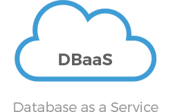
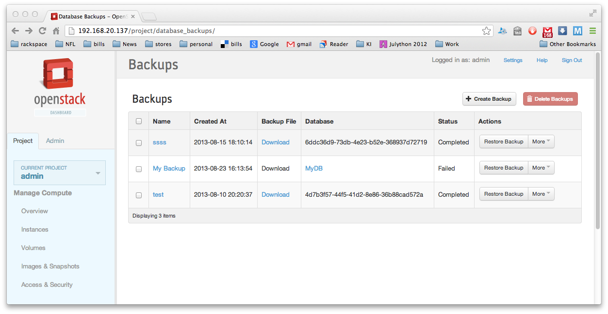
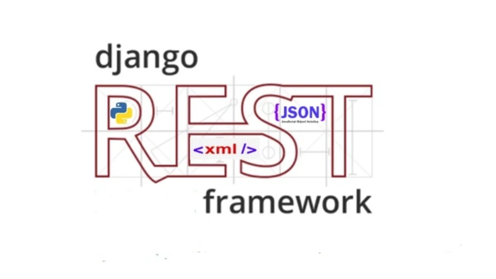
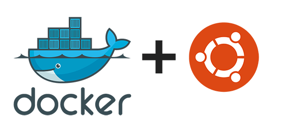

# Đề tài: Xây dựng cơ chế backup tự động cho Database as a Service

**Phùng hoàng long - Mã sv: B18DCCN359**

## Mục đích

DBaaS cung cấp các dịch vụ của Database dựa trên hạ tầng Cloud.
Sản phẩm DBaaS bọn em đang phát triển dựa trên một nền tảng OpenSource khá nổi tiếng: `OpenStack Trove`.

Đối tượng khách hàng mà bọn em đang nhắm đến là các doanh nghiệp, nhu cầu về việc sử dụng DBaaS của họ là khá cao với số lượng lớn. Vì vậy cần phải có những tính năng tự động để giảm tối thiểu các hành động thủ công, hạn chế human errors cũng như đảm bảo tính chất vốn có của một Cloud Service.

Hiện tại, các service của `Trove` mới chỉ hỗ trợ các tính năng cơ bản của một DBaaS, các tính năng còn thiếu khá nhiều, trong đó có tính năng **tự động thực hiện Backup định kỳ**.

Mục tiêu cuối của em sẽ là hoàn thiện tính năng **tự động thực hiện Backup định kỳ** cho DBaaS để đưa lên sản phẩm cuối cho người dùng sử dụng.

## Chức năng

- Cho phép người dùng thực hiện quản lý thông tin của các Database Instance trên web service, trong đó có thông tin về công việc tự động backup.

- Khi một Database Instance được tạo mới, tự động gán task thực hiện backup tự động cho Database Instance.

- Thực hiện Backup tự động, đảm bảo tính đầy đủ, không dư thừa và không làm ảnh hưởng xấu đến trải nghiệm người dùng.

## Công nghệ 

- Thực hiện xây dựng cơ chế dựa trên mô hình `Microservice`.

- Các webservice được xây dựng với Django REST Framework.

- Ubuntu + Docker.

- Kubernetes.

- Và các thư viện hỗ trợ của python.

## Khó khăn

- Các chức năng phải đảm bảo các tính chất vốn có của Cloud Service: tính sẵn sàng cao, tính bảo mật, tính đồng bộ, ảo hóa và tự động hóa, ...
- Bao trùm và xử lý được các trường hợp có thể gây đến Failover.
- Đảm bảo kết nối vào giao tiếp giữa các microservice, đảm bảo dữ liệu giữa các microserver được đẩy đủ và không dư thừa.
- Đảm bảo hiệu năng cho từng microservice trong mọi trường hợp.

## Yếu tố mới

Đây là một trong những dịch vụ mà em đang xây dựng ở Viettel.

Hiện tại trên thế giới đã có những ông lớn như Google Cloud hay AWS đã xây dựng chức năng này cho người dùng nhưng bọn em sẽ là người tiên phong cung cấp tính năng này cho người dùng tại thị trường Việt Nam.